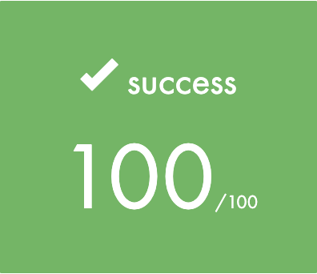

# inception

School 42 Project. Set up a small infrastructure composed of WordPress with LEMP Stack (Nginx, MariaDB and PHP) using Docker / Docker-Compose under specific rules (see `Subject.pdf`).
<br></br>

# Final grade: 100/100

 <br></br>

## Docker containers

- MariaDB
- WordPress
- Nginx


## How to use

- Build the images and deploy the infrastructure:

  ```sh
   $ make
   ```

- Stop and remove containers, remove images, volumes and network:

	```sh
	$ make clean
	```

